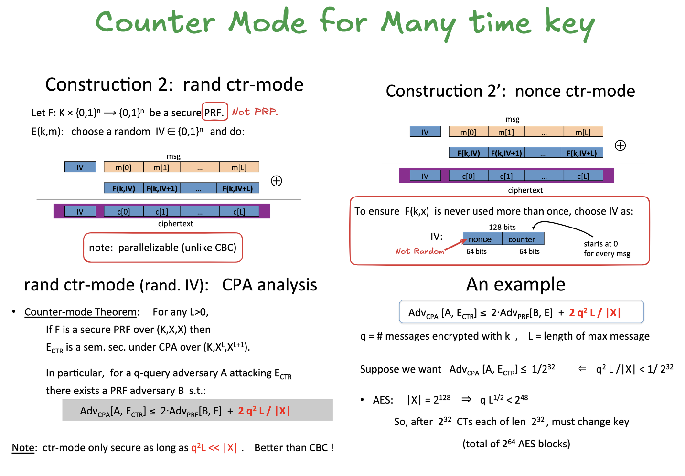

## Modes of Operation for Many Time Key: CBC and CTR

Implement two encryption/decryption systems, one using AES in CBC mode and another using AES in counter mode (CTR).  In both cases the 16-byte encryption IV is chosen at random and is prepended to the ciphertext.

For CBC encryption we use the PKCS5 padding scheme. While we ask that you implement both encryption and decryption, we will only test the decryption function.  In the following questions you are given an AES key and a ciphertext (both are hex encoded ) and your goal is to recover the plaintext and enter it in the input boxes provided below.

### Cipher Block Chaining

### Random based Counter 

