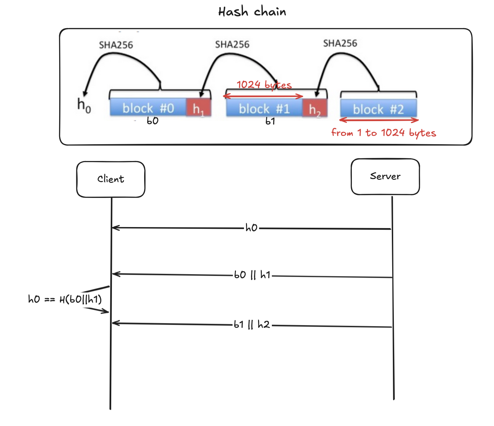

# File Authentication System

Our goal in this project is to build a file authentication system that lets browsers authenticate and play video chunks as they are downloaded **without having to wait for the entire file**. Instead of computing a hash of the entire file, the web site breaks the file into 1KB blocks (1024 bytes).  It computes the hash of the last block and appends the value to the second to last block.  It then computes the hash of this augmented second to last block and appends the resulting hash to the third block from the end.   

When appending the hash value to each block, please append it as binary data, that is, as 32 unencoded bytes (which is 256 bits).  If the file size is not a multiple of 1KB then the very last block will be shorter than 1KB, but all other blocks will be exactly 1KB.

Your task is to write code to compute the hash $h_0$ of a given file $F$ and to verify blocks of $F$ as they are received by the client. 

