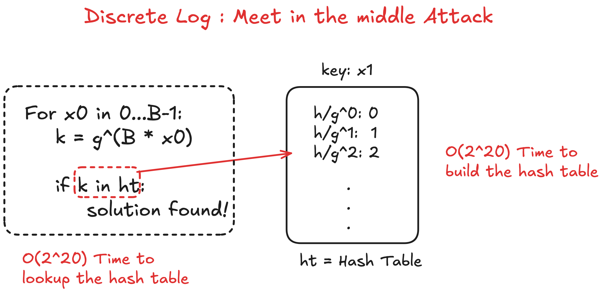
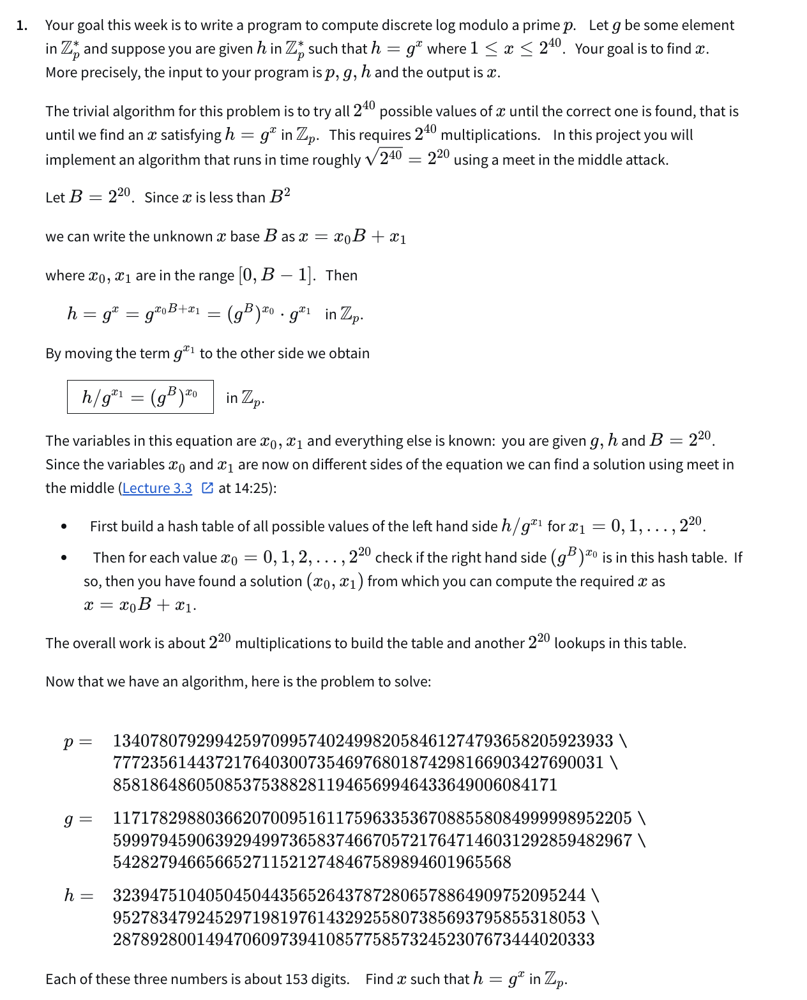

# Discrete Logarithm Algorithm with meet-in-the-middle attack

Rely on the fact that $x < B^2$ where $B = 2^{20}$.



Performance Optimisations:

1. build the hash table in parrell by each thread computing $h/g^{x_1}$ for their own $x_1$ range partition.
2. lookup the hash table in parrell by each thread computing $g^{B{x_0}}$ for their own $x_0$ range partition.

# Usage

run the code with the following command:

```bash
./main.py <input_file> <num_threads>
```

input file format:

```json
{
  "p": "23",
  "g": "5",
  "h": "4",
}
```

# Problem

Find $x$ such that $h = g^x \in Z_p$.


