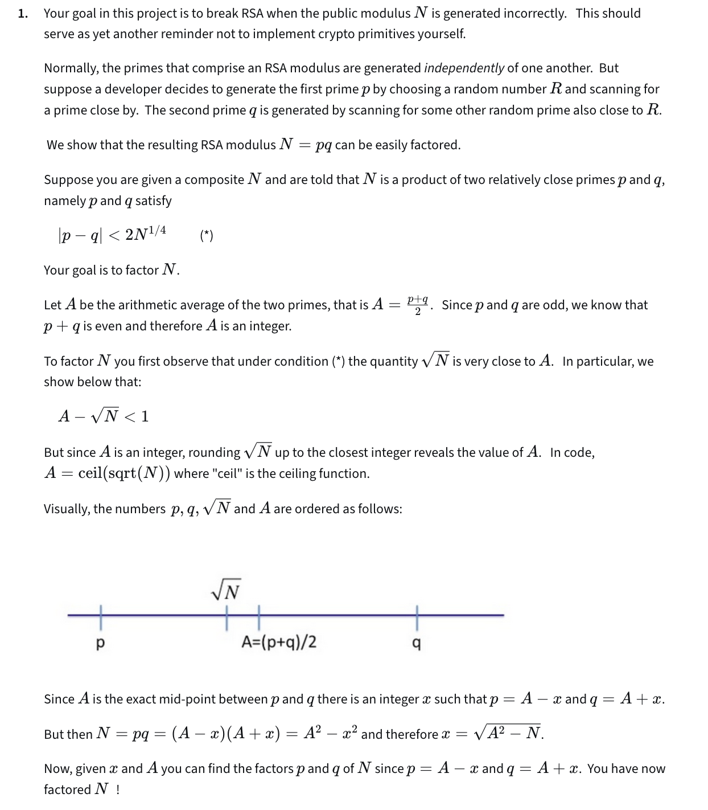
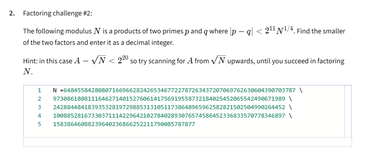
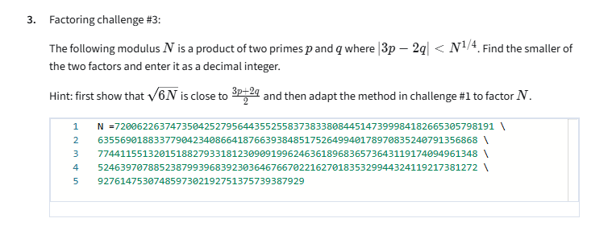
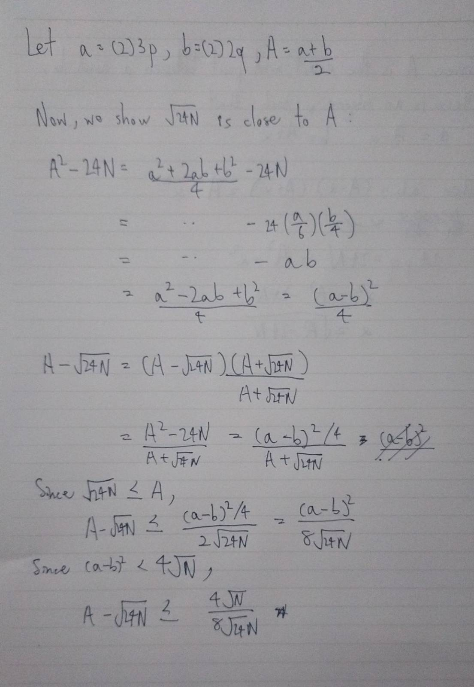
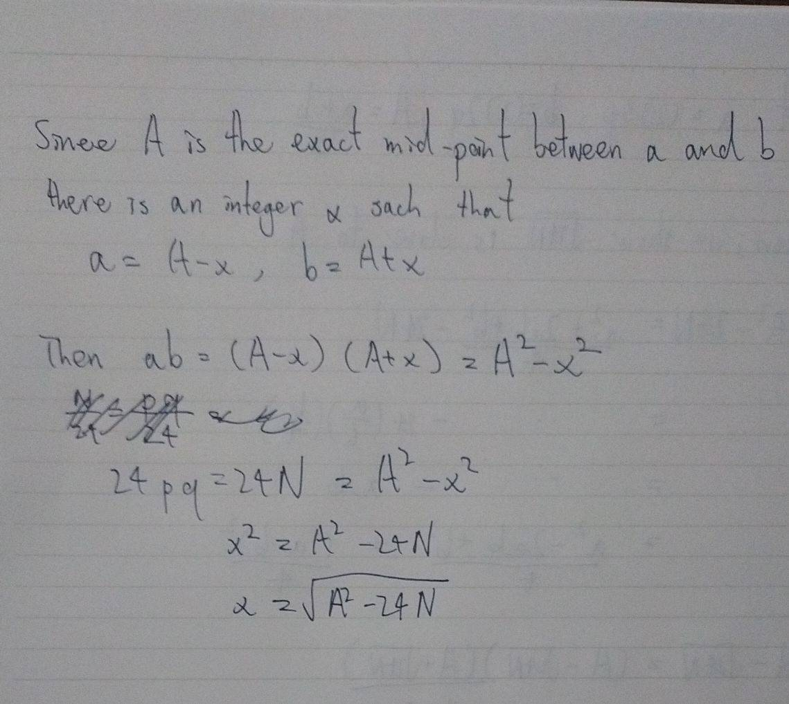
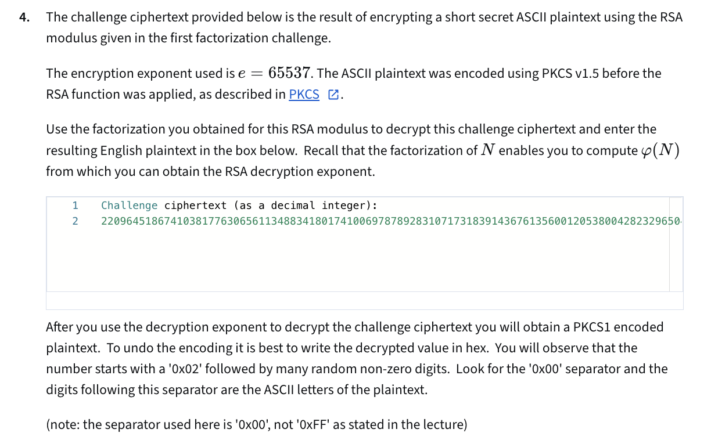

# Goal

The goal in this project is to break RSA when the public modulus N is generated incorrectly. This should serve as yet another reminder not to implement crypto primitives yourself.

# Q1

Run [src/q1/main.py](src/q1/main.py)

# Q2

Run [src/q2/main.py](src/q2/main.py)

# Q3

Tip: Do not try to solve for p and q. Solve for 3p and 2q instead.

Run [src/q3/main.py](src/q3/main.py)

# Q4

Run [src/q4/main.py](src/q4/main.py)
