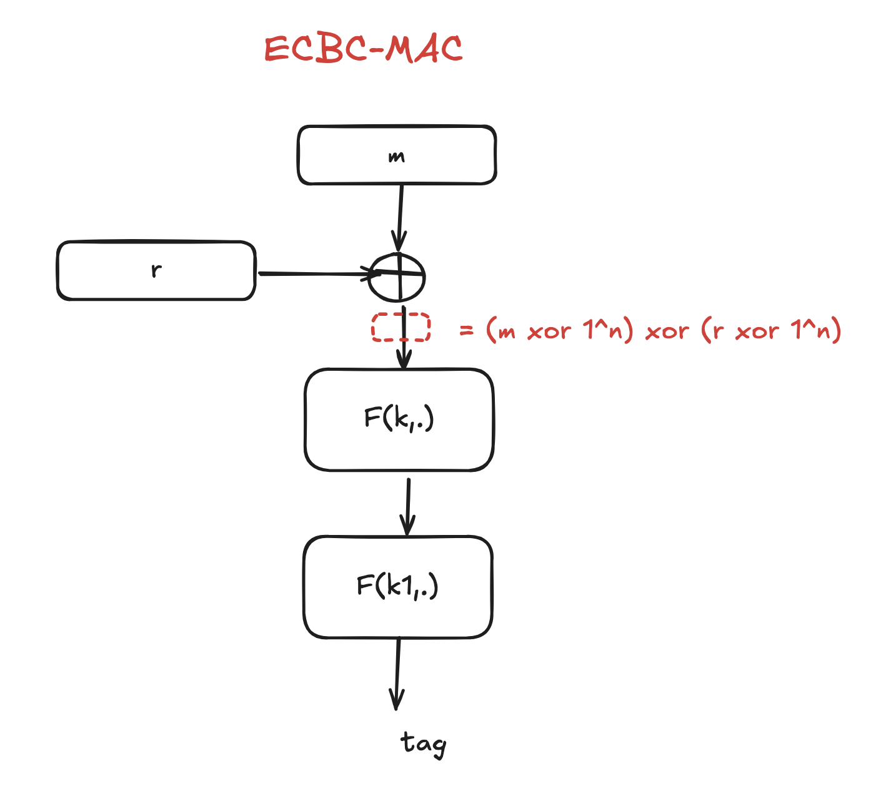
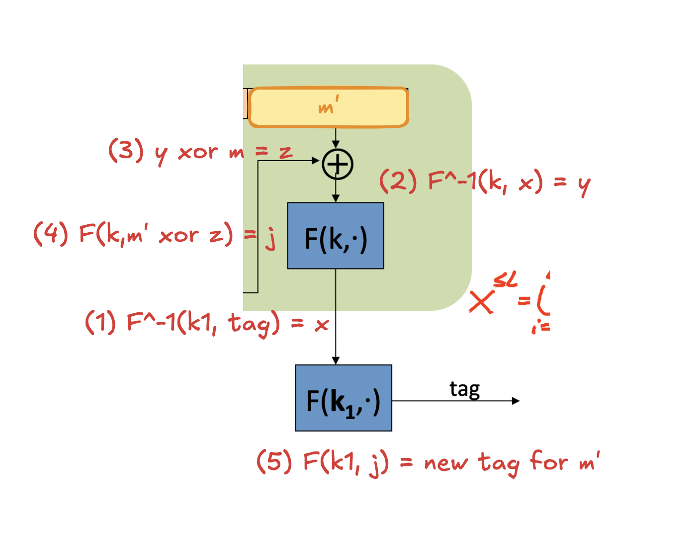

## Hints

### Q1

The MAC signing algorithm S is applied to the **file contents and nothing else**.

### Q2

#### Insecure

1. $V'(k, m, t) \text{ if } x \neq 0$
1. $S'(k, m) = S(k, m xor m)$
1. $S'(k,m) = S(k, m[0,...,n-2]||0)$ and $V' = V(k, m[0,...,n-2]||0,t)$: $m' = m[0,...,n-2]||1$ 

### Q3

### Q4

No one know all of $B_i$ keys except $A$.

### Q5

### Q6

#### Non Collision Resistance

1. $H'(m) = H(0)$
1. $H'(m) = H(m[0,...,n-2])$
1. $H'(m) = H(m)[0,...,31]$: output space is too small (${0,1}^32$)
1. $H'(m) = H(m) xor H(m xor 1^{|m|})$: $H'(m)$ always $= 1$

### Q9

$y_2 = y_1 xor AES(x_1, x_1) xor AES(x_2, x_2)$

### Q10

> The hand-waving argument goes thus: when you accumulate 𝑛 hash outputs, you are actually producing 𝑛3/6 triplets, each of them having probability 𝑡−2 to be a three-way collision (where 𝑡=|𝑇| , i.e. the size of the output space). So you should expect the first three-way collision to appear when 𝑛3/6=𝑡2 , i.e. 𝑛=6·𝑡2/3 . For a perfect hash function with 128-bit output, this means that you would need about 288 hash function invocations.

https://crypto.stackexchange.com/questions/10762/three-way-hash-collision
