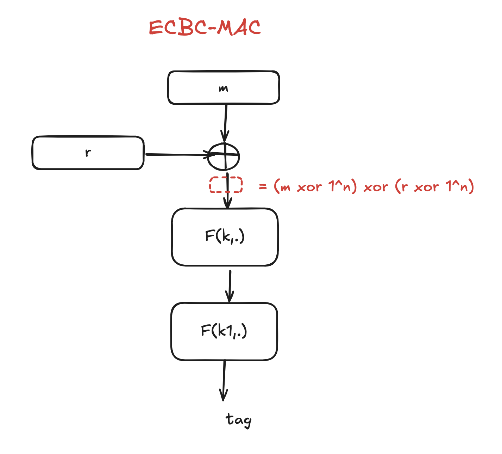

## Hints

### Q1

The MAC signing algorithm S is applied to the **file contents and nothing else**.

### Q2

#### Insecure

1. $V'(k, m, t) \text{ if } x \neq 0$
1. $S'(k, m) = S(k, m xor m)$
1. $S'(k,m) = S(k, m[0,...,n-2]||0)$ and $V' = V(k, m[0,...,n-2]||0,t)$: $m' = m[0,...,n-2]||1$ 

### Q3

### Q4

No one know all of $B_i$ keys except $A$.

### Q6

#### Non Collision Resistance

1. $H'(m) = H(0)$
1. $H'(m) = H(m[0,...,n-2])$
1. $H'(m) = H(m)[0,...,31]$: output space is too small (${0,1}^32$)
1. $H'(m) = H(m) xor H(m xor 1^{|m|})$: $H'(m)$ always $= 1$

