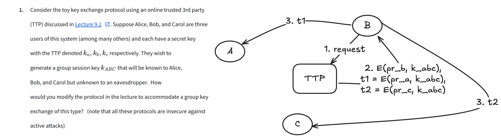

# Q1

# Q7

See [q7.py](q7.py)

# Q9

Q: While we are at it, how much is $2^{245}$ mod $Z_{35}$?

Let $N = 35$ and two primes $p = 7, q= 5$ such that $pq = 35$.

The phi of $N = (p-1)(q-1) = 24$.

So $2^{24} = 1 \in Z_{35}$.

$2^{245} = 2^5 \times {2^{24}^{10}} = 2^5 = 32 \in $Z_{35}$.

# Q10

Q: What is the order 2 of the set of invertiable elements of $Z_{35}$?

A:

The group $g = \{1, 2, 2^2, 2^3, ..., 2^{35-1} \}$.

The order of $g$ is number of the smallest $a$ suthat $g^a = 1$ in $Z_{35}$.

See [q10](q10.py)

# Q11

Q: What is the generator of the set of invertiable elements of $Z_{12}$?
 
A:

find the order of $g(n)$ for $n = 2$ to $12$ where the size of $g(n) = 13 - 1 = 12$.

See [q11](q11.py)

# Q12

Q: Solve the equation $x^2 + 4x + 1 = 0 \in Z_{23}$.

A:

1. find $(2a)^{-1} \in Z_{23} = 2^{-1} \in Z_{23}$ using extended euclid.

$(2^{-1} = 12 \in Z_{23}$.
2. find the squard root of $b^2 - (4 \times a \times c) = 4^2 - 4 \times 1 \times 1 = 12 \in Z_{23}$.

Since $12^{12} = 1 \in Z_{23}$, $12$ is a quadratic residue (Q.R) $\in Z_{23}$.

Then the squad root of $12 \in Z_{23}$ is $12^{(23+1)/4} = 9 \in Z_{23}$

So $x = (-4 + 9) \times 12  = 14 \in Z_{23}$ or $x = (-4 - 9) \times 12 = 5 \in Z_{23}$

# Q13

Q: What is 11th root of 2 in $Z_{19}$?

1. $gcd(11, 19 - 1) = 1$
2. $11^{-1} = 5 in Z_{18}$
3. So there exists $k \in Z_{18}$ such that $k \times 18 + 1 = 5 * 11 = 55$. $k = 3$.
4. $2^{{5}^{11}} = 2^{{3 \times 18} + 1} = {2^{18=19-1}}^{3} \times 2 \in Z_{19}$.

So $2^{1/11} = 2^{5} \in Z_{19} = 13 \in Z_{19}$.

# Q14

Q: What is the discete log of 5 base 2 in $Z_13$?

See [q14](q14.py)
