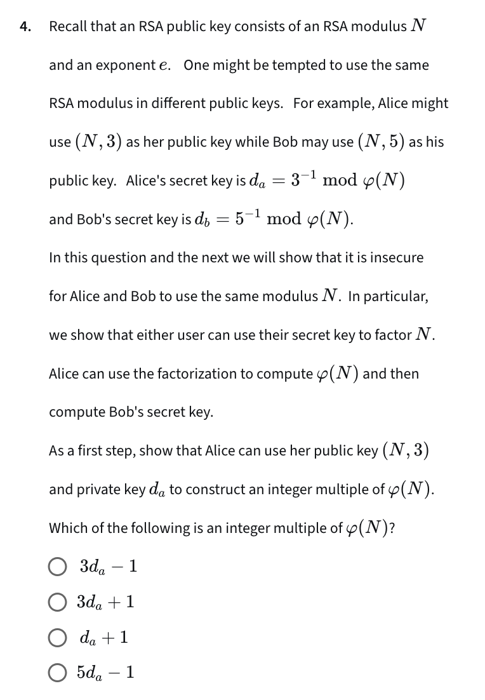
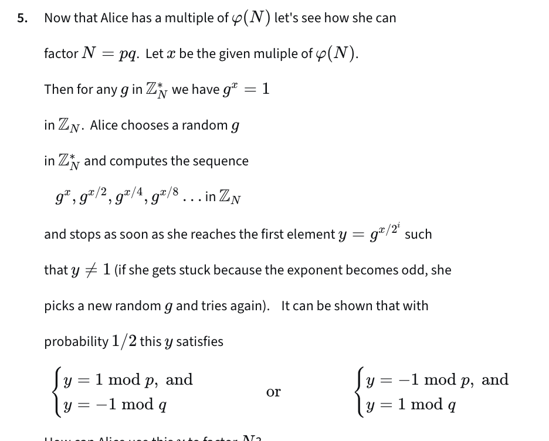
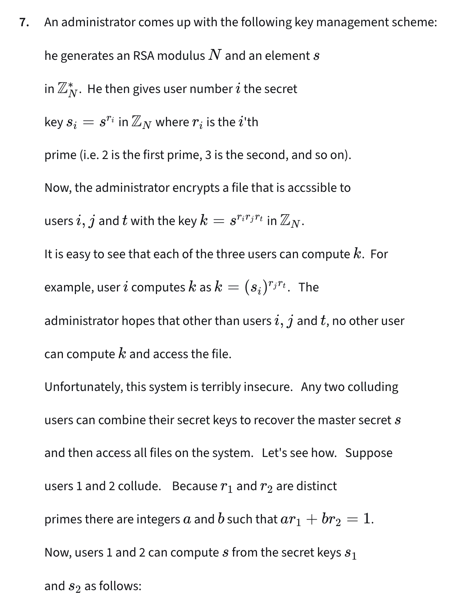
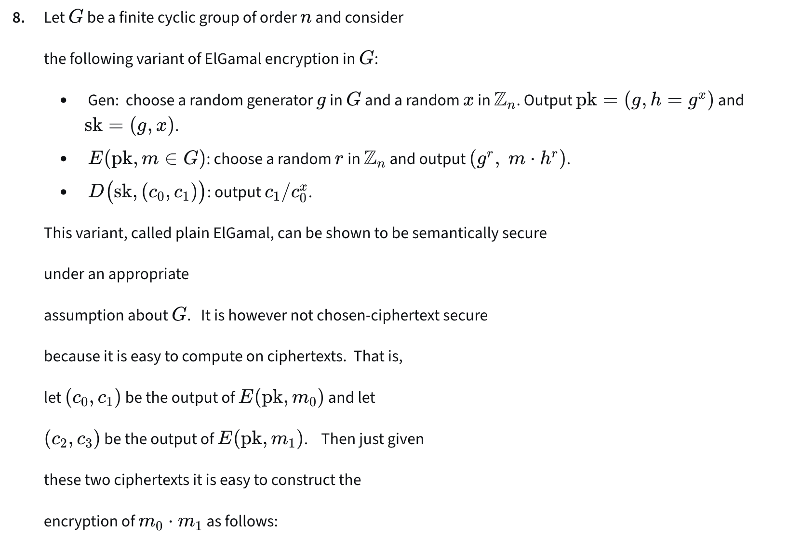
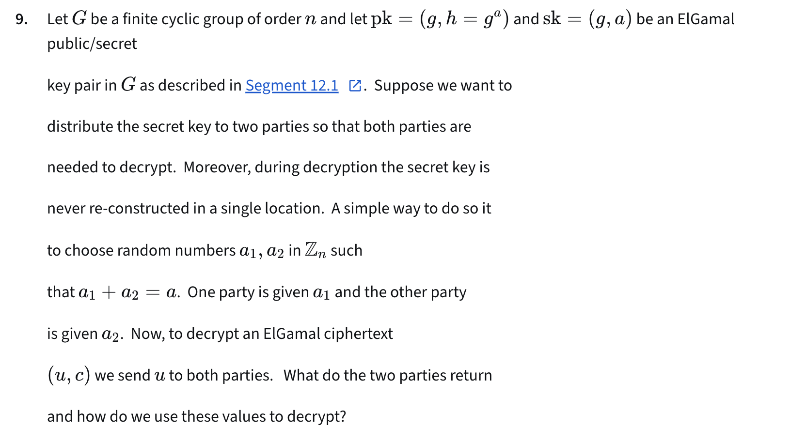
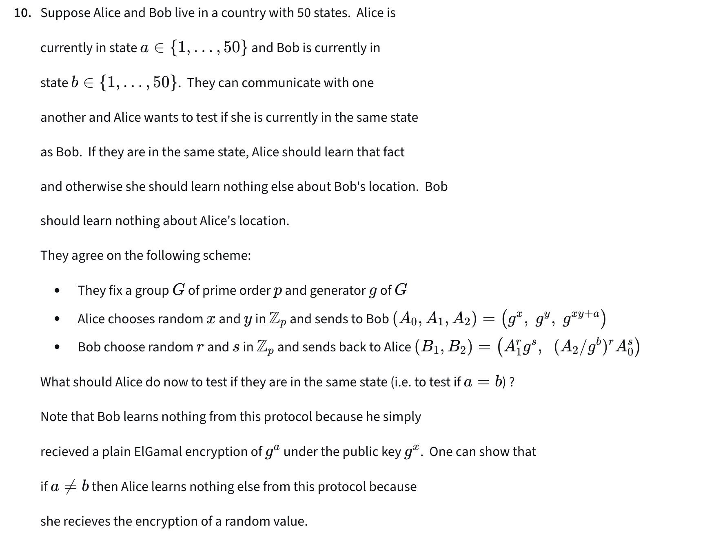

# Q1

> Recall that with symmetric ciphers it is possible to encrypt a 32-bit message and obtain a 32-bit ciphertext (e.g. with the one time pad or with a nonce-based system). Can the same be done with a public-key system?

No. 

# Q2 

> Question 2 Let (Gen , E, D) left parenthesis, start text, G, e, n, end text, comma, E, comma, D, right parenthesis be a semantically secure public-key encryption system.  Can algorithm E be deterministic?

No for CCA secure.

# Q4

1. 3 * da = 1 mod phi(n)
1. 3 * da = 1 + k * phi(n)
2. 3 * da - 1 = k * phi(n) 

# Q5

1. when y != 1 in Z_N, it means x / 2^i is not multiple of phi(n)
2. the first y thay y != 1 in Z_N means x / 2^i is an number that close to p and q where n = p * q

# Q7

s = s_1 ^ a * s_2 ^ b = s ^ (a * r1) * s ^ (b * r2) = s ^ (a * r1 + b * rb2 = 1) = s in Z_N

# Q8

- c_0 = g ^ r_0
- c_1 = m * h ^ r_0
- c_2 = g ^ r_1
- c_3 = m * h ^ r_1

- c_0 * c_2 = g ^ (r_0 + r_1)
- c_1 * c_3 = m_0 * m_1 * h ^ (r_0 + r_1)

# Q9

- u1 = u ^ a1 = g ^ (b * a1)
- u2 = u ^ a2 = g ^ (b * a2)
- u1 * u2 = g ^ (b(a1 + a2)) = g ^ (a * b)

# Q10

If a = b,

B_2 / B_1 ^ x = g ^ (xyr + xs) / g ^ (xyr + xs) = 1

