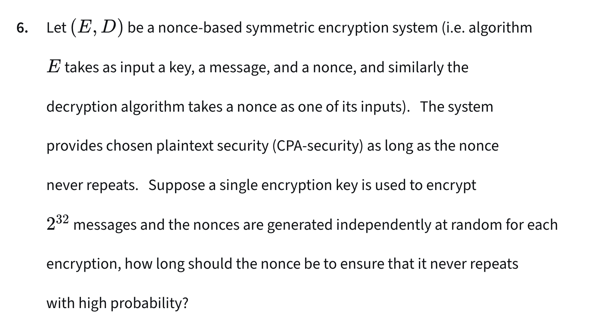

# Q1

Encrypt and then apply Errr correction code to the ciphertext.

# Q3

## One time semantic Security

An adversary sends two plaintext messages of equal length to the challenger and receives one encrypted message; semantic security means an adversary can’t distinguish which plaintext message was encrypted.

## Chosen Plaintext Security

An adversary sends q pairs of plaintext messages to the challenger; the challenger encrypts either the first messages or the second messages and sends them to an adversary; semantic security means an adversary can’t distinguish which messages (first or second) were encrypted.

## Perfectly Security

Perfect security refers to a cryptographic system where the ciphertext reveals absolutely no information about the original message — even if an attacker has unlimited computing power

## Ans

(E1, D1) is one time semantic secure but not perfectly secure because the cipher is deterministic. The attacker the bruce force all possible keys to reveal the plaintext.

# Q6

birthday paradox

# Q12

g^b = Y_i ^ (1 / a_i) = g ^ ( a_i * b ) * ( 1 / a_i)

# Q13

1. phi(p) = |{ invertible elements in Z_p }| = |{ 1, 2, ..., p - 1}| = p - 1
2. d = e ^ -1 mod (phi(p))

